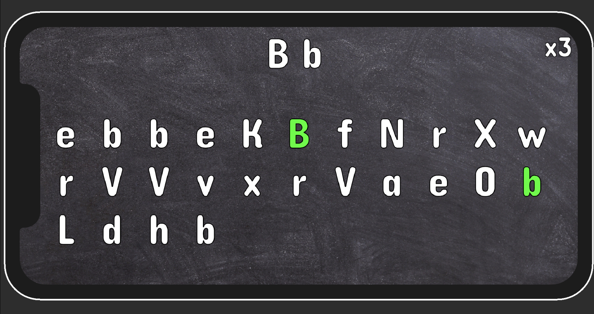

# Introduction

This project is a revisiting the a [game](https://youtu.be/ZuH2f0knvh8) developed from youtuber  [Jason Weimann](https://www.youtube.com/channel/UCX_b3NNQN5bzExm-22-NVVg) in Unity.

# GOAL
The goal was to refactoring of the base code with the introduction of a nifty event-listener pattern via [Unity Atoms](https://adamramberg.github.io/unity-atoms/).

